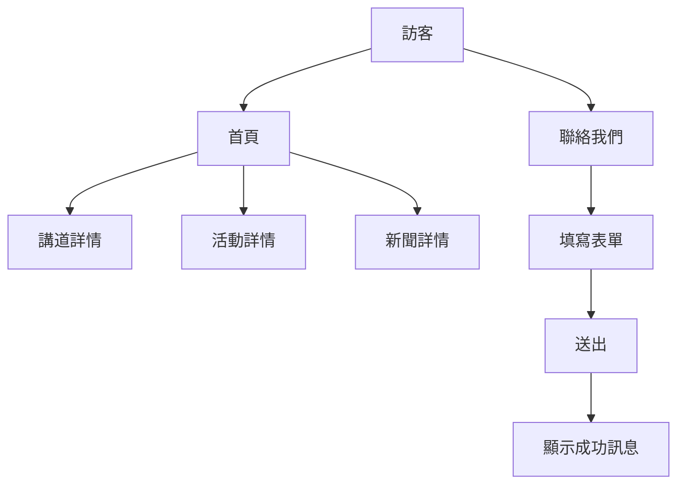
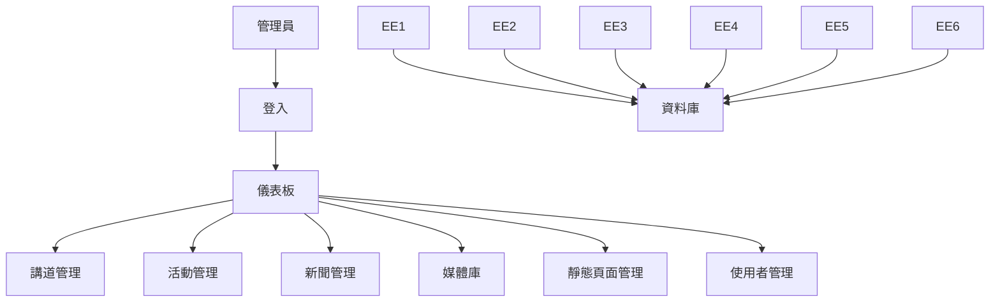

# 教會網站建置專案規格書

## 1. 專案目標
- 建立一個現代化、易於管理且安全的教會官方網站。
- 提供教會資訊、活動、講道等內容的線上展示平台。
- 實現後台管理功能，方便教會人員進行內容更新與維護。

## 2. 專案範圍
- 前端網站開發：以 HTML5、CSS3、Bootstrap、jQuery 為主，響應式設計。
- 後台管理系統開發：以 PHP 為主。
- 資料庫設計與建置：MySQL，根據網站需求設計資料表。
- 系統整合：前後端與資料庫串接，API 設計。

## 3. 主要功能
### 3.1 前台網站
- 首頁：最新消息、活動預告、講道精選 [已完成]
- 關於我們：教會簡介、信仰、異象 [已完成]
- 講道專區：列表 [已完成]、詳情 [未完成]、音檔/影片 [未完成]
- 活動日曆：活動列表 [已完成]、詳情 [未完成]
- 最新消息/公告：列表 [已完成]、詳情 [未完成]
- 聯絡我們：表單 [已完成]、地圖 [未完成]
- 響應式設計 [已完成]

### 3.2 後台管理
- 儀表板：數據總覽 [已完成]
- 講道管理（CRUD、上傳音檔/影片）[已完成]
- 活動管理（CRUD）[已完成]
- 新聞/公告管理（CRUD）[已完成]
- 靜態頁面管理（如關於我們、聯絡我們）[已完成]
- 使用者/權限管理 [已完成]
- 媒體庫（圖片/檔案管理）[已完成]
- 系統設定（網站資訊、SEO）[已完成]

## 4. 技術棧
- 前端：HTML5、CSS3、Bootstrap、jQuery
- 後端：PHP
- 資料庫：MySQL

## 5. 資料表設計（建議）
| 資料表         | 主要欄位說明                                                                 |
| -------------- | -------------------------------------------------------------------------- |
| users          | id, username, password, role, created_at, updated_at                      |
| sermons        | id, title, date, speaker, content, audio_url, video_url, created_at, updated_at |
| events         | id, title, date, location, description, created_at, updated_at             |
| news           | id, title, content, published_at, created_at, updated_at                   |
| pages          | id, slug, title, content, updated_at                                       |
| media_library  | id, file_name, file_path, file_type, uploaded_at, uploaded_by              |

## 6. API 設計（主要端點範例）
- GET /api/sermons
- POST /api/sermon
- PUT /api/sermon/{id}
- DELETE /api/sermon/{id}
- GET /api/events
- POST /api/event
- GET /api/news
- POST /api/upload
- GET /api/pages/{slug}
- POST /api/login

## 7. 權限與角色
- 管理員（Admin）：擁有所有後台功能
- 編輯者（Editor）：可管理內容，無法管理使用者與系統設定
- 一般訪客（Visitor）：僅能瀏覽前台內容

## 8. 測試與驗收標準
- 功能、權限、響應式、效能、安全性測試
- 驗收標準：所有功能可正常操作，資料正確，權限正確，主流瀏覽器相容

## 9. 維運與備份
- 定期自動備份資料庫與媒體檔案
- 系統錯誤與異常需有日誌記錄
- 提供簡易還原與維護說明文件

---

## 14. 實體流程圖（建議）

> 請參考下列文字描述繪製流程圖，建議使用 draw.io、Figma、Visio 等工具：

### 前台主要流程
- [訪客] → [首頁] → [點擊講道/活動/新聞] → [詳情頁]
- [訪客] → [聯絡我們] → [填寫表單] → [送出] → [顯示成功訊息]

### 後台主要流程
- [管理員] → [登入] → [儀表板] → [選擇模組] → [新增/編輯/刪除] → [資料庫]

---

## 15. Swagger/OpenAPI 文件（精簡範例）

```yaml
openapi: 3.0.0
info:
  title: Church Website API
  version: 1.0.0
paths:
  /api/sermons:
    get:
      summary: 取得講道列表
      responses:
        '200':
          description: 成功
          content:
            application/json:
              schema:
                type: array
                items:
                  $ref: '#/components/schemas/Sermon'
    post:
      summary: 新增講道
      requestBody:
        required: true
        content:
          application/json:
            schema:
              $ref: '#/components/schemas/SermonInput'
      responses:
        '201':
          description: 建立成功
  /api/sermon/{id}:
    get:
      summary: 取得單一講道
      parameters:
        - in: path
          name: id
          required: true
          schema:
            type: integer
      responses:
        '200':
          description: 成功
          content:
            application/json:
              schema:
                $ref: '#/components/schemas/Sermon'
components:
  schemas:
    Sermon:
      type: object
      properties:
        id:
          type: integer
        title:
          type: string
        date:
          type: string
          format: date
        speaker:
          type: string
        content:
          type: string
        audio_url:
          type: string
        video_url:
          type: string
    SermonInput:
      type: object
      required:
        - title
        - date
        - speaker
      properties:
        title:
          type: string
        date:
          type: string
          format: date
        speaker:
          type: string
        content:
          type: string
        audio_url:
          type: string
        video_url:
          type: string
```

---

## 16. 更細部欄位驗證規則

### 講道 Sermons
- title：必填，長度 1~100 字，禁止特殊字元（如 < > ' "）
- date：必填，格式 YYYY-MM-DD，必須為今日或過去日期
- speaker：必填，長度 1~50 字，僅允許中英文與空白
- content：可選，長度不限，允許 HTML
- audio_url/video_url：可選，必須為合法 URL，且副檔名需為 mp3/mp4/youtube 連結

### 使用者 Users
- username：必填，長度 4~50 字，僅允許英數字，首字不可為數字
- password：必填，長度 8~50 字，需包含英數字
- role：必填，限 admin/editor

### 活動 Events
- title：必填，長度 1~100 字，禁止特殊字元
- date：必填，格式 YYYY-MM-DD，必須為未來日期
- location：必填，長度 1~100 字，允許中英文與數字
- description：可選，長度不限

### 新聞 News
- title：必填，長度 1~100 字，禁止特殊字元
- content：必填，長度 10 字以上
- published_at：必填，格式 YYYY-MM-DD HH:MM:SS

---

## 17. Mermaid 流程圖語法（可直接貼於支援 mermaid 的 Markdown 編輯器）

### 前台主要流程


### 後台主要流程


---

如需更多 mermaid 圖例或複雜流程，請再提出！