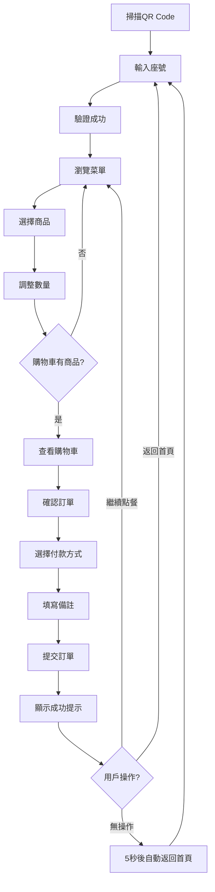

# 🍽️ 餐廳QR Code點餐系統 - 專案規格書 (v2.0)

## 📋 專案基本資訊

| 項目 | 內容 |
|------|------|
| **專案名稱** | 餐廳QR Code點餐系統 |
| **專案類型** | 響應式網頁應用程式（PWA） |
| **目標使用者** | 餐廳顧客、餐廳管理員 |
| **開發規模** | 小型個人練習專案 |
| **設計風格** | 手機優先、暖色系、簡潔易用 |
| **參考應用** | 麥味登APP點餐系統 |
| **開發日期** | 2025年6月20日 |
| **當前版本** | v2.4 (自動返回功能) |

---

## 🎯 專案目標

### 主要目標
- 解決傳統餐廳點餐效率問題
- 提供便捷的手機點餐體驗
- 簡化餐廳訂單管理流程

### 核心價值
- **便利性**：顧客無需等待服務生，自主點餐
- **效率性**：減少人工點餐錯誤，提升翻桌率
- **即時性**：訂單即時傳達，狀態即時更新

---

## 👥 使用者分析

### 主要使用者：餐廳顧客
- **使用場景**：在餐廳用餐時使用手機點餐
- **使用需求**：快速瀏覽菜單、輕鬆點餐、了解訂單狀態
- **技術水平**：一般手機使用者

### 次要使用者：餐廳管理員
- **使用場景**：管理菜單、處理訂單、更新製作狀態
- **使用需求**：簡單易用的管理介面、即時訂單通知
- **技術水平**：基礎電腦操作能力

---

## 🚀 功能需求規格

### 2.1 顧客端功能模組 ✅

| 功能模組 | 詳細說明 | 優先級 | 狀態 | 備註 |
|----------|----------|---------|------|------|
| **QR Code流程** | 掃碼後直接進入座號輸入頁面 | 高 | ✅ 完成 | 已簡化為單一流程 |
| **座號輸入** | 支援數字和英數混合格式 | 高 | ✅ 完成 | 支援A01-Z99、1-99格式 |
| **菜單瀏覽** | 分類篩選、搜尋、商品展示 | 高 | ✅ 完成 | 含圖片、描述、價格、標籤 |
| **數量控制** | 直接在卡片上調整數量 | 高 | ✅ 完成 | 初始值0，+/-按鈕，即時加入購物車 |
| **購物車管理** | 導航欄購物車，直接清空 | 高 | ✅ 完成 | 移除服務費，一鍵清空 |
| **訂單確認** | 確認餐點內容與總金額 | 高 | ✅ 完成 | 結帳頁面訂單摘要 |
| **結帳頁面** | 選擇付款方式與提交訂單 | 高 | ✅ 完成 | 支援現金/刷卡/行動支付，備註功能 |
| **訂單歷史** | 查詢過往訂單記錄 | 中 | ⏳ 待開發 | 基於瀏覽器本地儲存 |

### 2.2 餐廳端功能模組

| 功能模組 | 詳細說明 | 優先級 | 狀態 | 備註 |
|----------|----------|---------|------|------|
| **管理員登入** | 基礎登入系統 | 高 | ⏳ 待開發 | admin/login.html 已預留 |
| **菜單管理** | 當天菜單的新增/編輯/刪除 | 高 | ⏳ 待開發 | 圖片上傳、分類管理、價格設定 |
| **訂單接收** | 即時接收顧客訂單 | 高 | ⏳ 待開發 | 新訂單通知、訂單列表顯示 |
| **訂單狀態管理** | 更新製作狀態 | 高 | ⏳ 待開發 | 待製作→製作中→完成 |
| **基本統計** | 當日訂單統計 | 低 | ⏳ 待開發 | 訂單數量、營業額統計 |

---

## 🔄 已實現的核心功能 ✅

### 顧客端完成功能
1. **首頁流程優化**
   - 掃碼後直接進入座號輸入頁面
   - 移除多餘的掃碼步驟
   - 自動聚焦座號輸入框

2. **菜單系統完善**
   - 分類篩選（全部、主食、飲品、甜點、小菜）
   - 搜尋功能
   - 商品卡片展示（圖片、名稱、描述、價格、標籤）
   - 數量控制直接在卡片上操作
   - 數量初始值為0，支援0-99數量範圍

3. **購物車優化**
   - 購物車按鈕移至導航欄右側
   - 與座號信息並排顯示
   - 移除10%服務費
   - 直接清空功能（無確認對話框）
   - 即時數量同步

4. **界面設計改進**
   - 響應式導航欄布局
   - 暖色系配色方案
   - 手機優先設計
   - 流暢的動畫效果

5. **結帳流程完整**
   - 訂單摘要頁面（商品、數量、金額）
   - 三種付款方式選擇（現金、信用卡、行動支付）
   - 智能付款流程：現金/信用卡需至櫃檯結帳，行動支付線上完成
   - 備註功能（最多200字）
   - 訂單提交與成功提示
   - 自動產生訂單編號
   - 預估製作時間計算
   - 不同付款方式的狀態管理

6. **成功提示優化**
   - 螢幕中央模態框彈出
   - 半透明背景遮罩效果
   - 多種關閉方式（點擊背景、ESC鍵、關閉按鈕）
   - 流暢的進入動畫效果
   - 根據付款方式顯示不同指示訊息

7. **自動返回機制**
   - 訂單完成後5秒自動返回首頁
   - 視覺化倒數計時顯示
   - 任何用戶交互自動取消倒數
   - 智能用戶體驗控制

### 技術架構實現
- PWA基礎功能（manifest.json、service worker）
- 本地儲存管理（購物車、訂單、座號）
- 模組化JavaScript架構（CheckoutPage、CartPage、MenuPage類別）
- CSS變數系統（統一色彩、間距、字型）
- 響應式設計（手機優先、多螢幕適配）
- 模態框系統（中央彈出、背景遮罩、多重關閉）
- 動畫效果（滑入、縮放、淡入淡出）
- 狀態管理（訂單狀態、付款狀態分離）
- 自動化流程（倒數計時、自動跳轉）

---

## 🛠️ 技術架構規格

### 3.1 前端技術堆疊

| 技術 | 用途 | 選擇理由 |
|------|------|----------|
| **HTML5** | 頁面結構 | 語義化標籤、響應式設計 |
| **CSS3** | 樣式設計 | Flexbox/Grid、暖色系、動畫 |
| **JavaScript (ES6+)** | 互動邏輯 | 原生JS、無額外依賴 |
| **PWA** | 應用體驗 | 離線使用、安裝到手機 |

### 3.2 後端服務

| 服務 | 用途 | 選擇理由 |
|------|------|----------|
| **Firebase Firestore** | 即時資料庫 | 免費額度、即時同步、易於使用 |
| **Firebase Storage** | 圖片儲存 | 整合性好、CDN加速 |
| **Firebase Hosting** | 網站部署 | 免費HTTPS、自動部署 |

### 3.3 第三方庫

| 庫名稱 | 用途 | 版本 |
|--------|------|------|
| **qrcode.js** | QR Code生成 | 最新穩定版 |

### 3.4 資料結構與流程 ✅

#### 本地儲存架構
```javascript
// localStorage 資料結構
{
  // 當前座號資訊
  "currentTable": {
    "number": "A12",
    "timestamp": "2025-06-20T10:30:00.000Z"
  },
  
  // 購物車資料
  "cart": [
    {
      "id": "menu001",
      "name": "招牌牛肉麵",
      "price": 150,
      "quantity": 2,
      "image": "images/beef_noodle.jpg"
    }
  ],
  
  // 當前訂單（結帳頁面使用）
  "currentOrder": {
    "tableNumber": "A12",
    "items": [...],
    "subtotal": 300,
    "total": 300,
    "createdAt": "2025-06-20T10:35:00.000Z"
  },
  
  // 已提交訂單
  "submittedOrders": [
    {
      "orderNumber": "ORD20250620103500ABCD",
      "tableNumber": "A12",
      "items": [...],
      "paymentMethod": "cash",
      "customerNote": "不要辣",
      "status": "awaiting_payment",
      "paymentStatus": "pending",
      "submittedAt": "2025-06-20T10:35:00.000Z",
      "estimatedTime": "15-20分鐘"
    }
  ]
}
```

#### 頁面間資料流程
```
首頁 → 菜單頁 → 購物車頁 → 結帳頁 → 成功提示 → 首頁
 ↓       ↓         ↓         ↓         ↓         ↑
座號   → 商品    → 確認    → 付款    → 完成    → 自動返回
存儲     加入購物車   修改數量   提交訂單   清理資料   (5秒倒數)
```

#### 狀態管理流程
- **座號驗證**：所有頁面載入時檢查 `currentTable`
- **購物車同步**：即時更新 `cart` 並顯示數量徽章
- **訂單處理**：`cart` → `currentOrder` → `submittedOrders`
- **資料清理**：成功提交後清除 `cart` 和 `currentOrder`

---

## 🎯 用戶流程與體驗

### 4.1 完整點餐流程 ✅



### 4.2 用戶體驗優化 ✅

| 優化項目 | 實現方式 | 用戶價值 |
|----------|----------|----------|
| **流程簡化** | 掃碼直接進入座號輸入 | 減少操作步驟 |
| **視覺回饋** | 數量控制、購物車徽章 | 即時狀態確認 |
| **錯誤預防** | 座號驗證、空購物車檢查 | 避免無效操作 |
| **智能引導** | 自動跳轉、倒數提示 | 自然操作流程 |
| **多重選擇** | 付款方式、關閉方式 | 靈活操作體驗 |

---

## 🏗️ 檔案架構

### 5.1 專案目錄結構 ✅

```
restaurant-qr-ordering-system/
├── index.html              # 首頁（座號輸入）
├── menu.html               # 菜單頁面
├── cart.html               # 購物車頁面
├── checkout.html           # 結帳頁面
├── manifest.json           # PWA配置
├── css/
│   └── styles.css          # 統一樣式表
├── js/
│   ├── app.js              # 首頁邏輯
│   ├── menu.js             # 菜單頁邏輯
│   ├── cart.js             # 購物車邏輯
│   ├── checkout.js         # 結帳頁邏輯
│   └── firebase-config.js  # Firebase配置（預留）
├── images/
│   ├── menu/               # 菜單圖片
│   └── icons/              # 圖示檔案
└── admin/                  # 餐廳端管理（未來開發）
    ├── login.html
    ├── dashboard.html
    └── orders.html
```

### 5.2 JavaScript 模組架構 ✅

```javascript
// 主要類別架構
class CheckoutPage {
  - 座號驗證
  - 訂單載入與渲染
  - 付款方式管理
  - 模態框控制
  - 自動返回機制
}

class CartPage {
  - 購物車項目管理
  - 數量控制
  - 金額計算
  - 清空功能
}

class MenuPage {
  - 菜單載入與渲染
  - 分類篩選
  - 搜尋功能
  - 購物車同步
}

// 全域函數
- goToMenu()
- goToCart()
- goToHome()
- closeSuccessModal()
```

### 5.3 頁面架構 ✅

#### 顧客端頁面結構（已實現）
```
├── 首頁 (index.html) ✅
│   ├── 歡迎標題
│   ├── 座號輸入卡片（直接顯示）
│   └── 使用說明
│
├── 菜單頁 (menu.html) ✅
│   ├── 導航欄（返回、標題、座號、購物車）
│   ├── 分類導航
│   ├── 搜尋功能
│   ├── 菜品網格（含數量控制）
│   └── 空狀態提示
│
├── 購物車頁 (cart.html) ✅
│   ├── 導航欄
│   ├── 訂單項目列表
│   ├── 金額計算（小計=總計）
│   ├── 清空購物車按鈕
│   └── 結帳按鈕
│
├── 結帳頁 (checkout.html) ✅
│   ├── 導航欄（返回、標題、座號）
│   ├── 訂單摘要（商品列表、金額計算）
│   ├── 付款方式選擇（現金、信用卡、行動支付）
│   ├── 備註輸入（200字限制）
│   ├── 提交按鈕（動態文字）
│   └── 成功模態框（螢幕中央彈出）
│       ├── 成功圖示與標題
│       ├── 付款指示訊息
│       ├── 訂單編號顯示
│       ├── 預估製作時間
│       ├── 自動返回倒數計時
│       └── 操作按鈕（繼續點餐、返回首頁）
│
└── 歷史頁 (history.html) ⏳
    ├── 訂單列表
    └── 訂單詳情
```

---

## 🧪 開發時程與里程碑

### Phase 1：專案建置 ✅ (已完成)
- [x] 專案規格制定
- [x] 檔案架構建立
- [x] 基礎樣式系統
- [x] 開發環境配置（HTTP Server）
- [x] PWA基礎設定

### Phase 2：核心功能開發 ✅ (已完成)
- [x] 首頁與座號輸入系統
- [x] 菜單瀏覽系統（分類、搜尋、展示）
- [x] 購物車功能（數量控制、本地儲存）
- [x] 導航欄整合設計
- [x] 響應式界面優化

### Phase 3：功能優化 ✅ (已完成)
- [x] 移除服務費計算
- [x] 數量控制優化（0起始、直接操作）
- [x] 購物車位置調整（導航欄）
- [x] 清空功能簡化（無確認對話框）
- [x] 用戶體驗流程簡化

### Phase 4：結帳系統 ✅ (已完成)
- [x] 結帳頁面開發
- [x] 付款方式整合
- [x] 訂單狀態管理
- [x] 成功提示優化
- [x] 自動返回機制

### Phase 5：進階功能 ⏳ (下一階段)
- [ ] Firebase雲端整合
- [ ] 餐廳端管理系統
- [ ] 即時訂單同步
- [ ] 推播通知

### Phase 6：進階功能 🔮 (未來規劃)
- [ ] 訂單歷史查詢
- [ ] 多語言支援
- [ ] 數據分析儀表板
- [ ] 進階自訂功能

---

## 🎯 成功指標與驗收標準

### 10.1 功能驗收 ✅

| 功能項目 | 驗收標準 | 狀態 |
|----------|----------|------|
| **座號輸入** | 支援A01-Z99、1-99格式，錯誤提示 | ✅ 通過 |
| **菜單瀏覽** | 分類篩選、搜尋、響應式卡片 | ✅ 通過 |
| **購物車** | 數量控制、即時同步、清空功能 | ✅ 通過 |
| **結帳流程** | 付款選擇、訂單提交、成功提示 | ✅ 通過 |
| **自動返回** | 5秒倒數、用戶交互取消 | ✅ 通過 |

### 10.2 用戶體驗標準 ✅

| 體驗項目 | 標準 | 實現狀況 |
|----------|------|----------|
| **流程順暢** | 3步完成點餐（座號→選餐→結帳） | ✅ 達成 |
| **視覺回饋** | 所有操作有即時回饋 | ✅ 達成 |
| **錯誤處理** | 清楚的錯誤提示與引導 | ✅ 達成 |
| **響應速度** | 頁面載入<2秒，操作回應<0.5秒 | ✅ 達成 |
| **手機適配** | 完美適配iPhone、Android | ✅ 達成 |

### 10.3 下階段目標 ⏳
- [x] ~~完整點餐到結帳流程~~ (已完成)
- [ ] Firebase雲端資料庫整合
- [ ] 餐廳端管理系統開發
- [ ] 即時訂單狀態同步
- [ ] 推播通知功能

---

## 📝 更新記錄

### v2.4 (2025-06-20) - 自動返回功能
- ✅ 成功模態框 5 秒後自動返回首頁
- ✅ 倒數計時顯示（按鈕和提示文字）
- ✅ 用戶交互時取消自動返回
- ✅ 多種取消方式：繼續點餐、返回首頁、關閉按鈕、ESC 鍵、點擊背景
- ✅ 視覺化倒數提示
- ✅ 智能用戶體驗：有操作意圖時停止自動跳轉

### v2.3 (2025-06-20) - 模態框 UI 優化
- ✅ 成功提示模態框改為螢幕中央彈出
- ✅ 添加模態框背景遮罩效果
- ✅ 支援點擊背景關閉模態框
- ✅ 支援 ESC 鍵關閉模態框
- ✅ 添加右上角關閉按鈕
- ✅ 優化模態框動畫效果（縮放+滑入）
- ✅ 防止背景滾動
- ✅ 響應式模態框設計

### v2.2 (2025-06-20) - 付款流程優化
- ✅ 優化付款方式處理邏輯
- ✅ 現金/信用卡改為櫃檯結帳模式
- ✅ 行動支付保持線上支付
- ✅ 根據付款方式顯示不同成功訊息
- ✅ 訂單狀態與付款狀態分別管理
- ✅ 按鈕文字動態更新
- ✅ 付款指示訊息樣式優化

### v2.1 (2025-06-20) - 結帳系統完成
- ✅ 完成結帳頁面開發（checkout.html + checkout.js）
- ✅ 實現訂單摘要展示（商品、數量、金額）
- ✅ 三種付款方式選擇（現金、信用卡、行動支付）
- ✅ 備註功能與字數限制（200字）
- ✅ 訂單提交與成功提示
- ✅ 自動訂單編號生成
- ✅ 預估製作時間計算
- ✅ 完整結帳流程與資料清理

### v2.0 (2025-06-20) - 核心功能完成
- ✅ 完成顧客端核心點餐流程
- ✅ 優化用戶體驗（簡化流程、移除服務費）
- ✅ 界面設計改進（導航欄整合、響應式）
- ✅ 數量控制優化（0起始、直接操作）

### v1.0 (2025-06-20) - 初始規格
- 📋 專案規格制定
- 🎨 設計方向確定
- 🏗️ 技術架構規劃

---

**規格書版本：2.4**  
**最後更新：2025年6月20日**  
**下次檢視：Firebase整合與餐廳端開發後**  
**目前狀態：顧客端點餐流程已完整（包含結帳），準備開發餐廳端管理系統**
